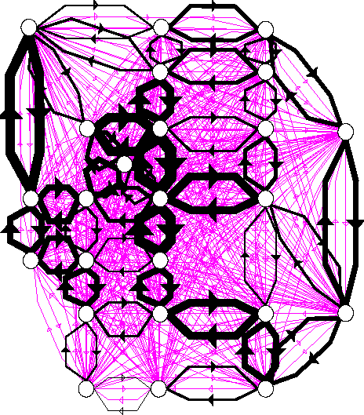
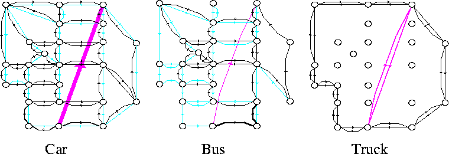

# CiudadSim: Scilab Traffic Assignment Toolboxes

This GitHub repository [CiudadSim](https://github.com/Lecrapouille/CiudadSim)
is a backup of the original work https://www.rocq.inria.fr/metalau/ciudadsim/home.htm

## Traffic Assignment - Wardrop equilibrium computation.

### Single-Class Static Assignment

A transport network consists of a graph and a family of functions associated to
each arc that measure the travel time on the arc. For some pairs of nodes there
is a demand of vehicles that want to go from the first node to the second one.

Under the assumption that the flow will be distributed according the Wardrop
criterium, the toolbox provides a variety of algorithms to compute such flow.

In the following example we can see the well known Siouf Falls network
(dessigned for academic purposes) with the flow obtained after the
assignment. The width of the arcs is proportional to the assigned flow. The arcs
in magenta represent the origin-destination pairs.

### Multi-Class Static Assignment.

In this case the demands are differentiated according to their transport class
(different values of time) and each class can use different modes (car, bus,
etc.). The travel time functions are non symetric with respect to the different
class/mode flows. Each class/mode can have prohibited arcs in the network.

In the following example we can see the Sioux Falls Network with three modes :
car, bus and truck. The figures show the flow of cars, the flow of busses and
the flows of trucks (the demands are shown in magenta).

## Authors

Pablo Lotito, Elina Mancinelli and the collaboration of Jean-Pierre Quadrat,
L. Wynter

Inria METALAU project.

## Version

Version 5. CiudadSim5 (CS5). This is a beta version. It is not completely
compatible with the previous version see the IMPROVEMENT section.

## License

LGPL.

## Availability

Works on Linux, Unix (Sun Solaris, Dec alpha), Windows, MacOSX.

## Installation

Put the archive in the contrib directory of
[ScicosLab](http://www.scicoslab.org/) (old name ScilabGtk).  It does not work
with the official consortium Scilab.  For old version of scilab before 4.1 it is
needed to install first the maxplus toolbox.

Unzip the archive.

Put the directory CS5 at the upper level of contrib if necessary (after some
unzip process the directory CS5 is inside another directory CS5).

When we sart scilab now a menu toolboxes must appear with CS5 inside.

## Loading

The toolbox is available after loading.  For that in the ScilabGtk menu
`toolboxes` click on CS5.  If everything works a message will appear in the
scilab window: `CiudadSim toolbox loaded ....`

Inside the scilab window the command `edit_graph` will open a window dedicated
to ciudadsim.

Try first the menu example to load an example.

There is an help completely consistant with the standard scilab help.  It is
`"Traffic assignment"` chapter of the scilab help.

There is a manual in the directory manual of the the directory CS5

There is a small demo but it must be loded in the directory demo.  It is not
available by the menu demo because it has to be improved.

## Demos

A demo is available by `exec "demo/TrafficAssignDemo.sce"` when the working
directory of scilab is CS4.

During the demo don't forget to save the edited graph. If you don't do that an
error message of Scilab will tell you that the edited graph does not exist.

Inside Windows the plotting facilities of Metanet do not work, this induces a
bug when these facilities are called.

## Manual

In the `help` menu of Scilab search for `Traffic Assignment Functions`. All the
functions are documented.

An html documentation is available in the directory and [online](https://lecrapouille.github.io/CiudadSim).

In the directory manual we can find the [complete manual](manual/manual.pdf) in
pdf.

## Improvements and modifications

- A set of compatible metanet macros are now given with the toolbox (indeed some
  new edit_graph macros ave incompatibilities with the ones used by
  CiudadSim. They are overwritten. To restore thes macros start a fresh scilab
  version).
- The new version works with edit_graph instead of SCIGRAPH.
- The speed of FW and DSD has been improved
- More algorithm are provided (Logit type algorithm and NewtArc)
- The highest level function have not anymore the argument `net` a global
  NetList variable `'%NET'` has been introduced which contains all the
  information
- The Netlist have more fields name of algorithm used, precision, etc....
- The variable 'ben' giving information about the way the algorithm has worked
  has been changed and unified between the different algorithm

## Problems

In case of difficulties for loading the toolboxes. Try the following procedure:
- Go inside the CS4 toolbox directory:
  `........../ScilabGtk/contrib/CS5/src`
- Remove all the object files
  `rm *.o *.lo *.a *.la *.so Make*`
- Remove the .dll only if you have a C compiler on windows.
- Leave scilab.
- Start scilab.
- Load CS5.

For problems, comments, ... send mail to :
- plotito@exa.unicen.edu.ar
- Jean-Pierre.Quadrat@inria.fr
